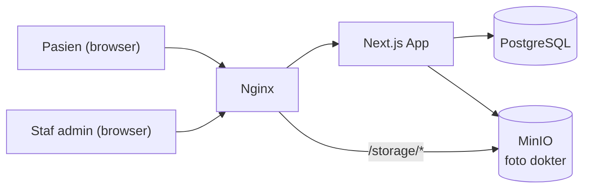

# Healthcare Facility Dashboard

Dashboard jadwal praktik dokter untuk klinik, puskesmas, praktik bersama, dan
rumah sakit kecil — menggantikan papan tulis, kertas laminating, atau grup
WhatsApp sebagai media informasi jadwal dokter ke pasien.

> Proyek open source (MIT). Bahasa Indonesia. Dibuat untuk fasilitas kesehatan
> kecil–menengah yang belum punya sistem informasi jadwal.

---

## ⚠️ Catatan Privasi & Tanggung Jawab Pengguna

**Baca bagian ini sebelum men-deploy aplikasi ini.**

- Aplikasi ini **TIDAK menyimpan data pasien** dalam bentuk apa pun — tidak
  ada nama pasien, NIK, nomor rekam medis, diagnosis, keluhan, riwayat
  kunjungan, atau hasil lab. Ini **bukan sistem rekam medis** dan **bukan
  pengganti SIMRS**. Aplikasi ini murni menampilkan jadwal praktik dokter
  (informasi yang memang untuk konsumsi publik) dan tidak menyediakan fitur
  pendaftaran/booking pasien.
- Siapa pun yang men-deploy aplikasi ini **bertanggung jawab penuh** atas
  kepatuhan terhadap regulasi yang berlaku di wilayahnya masing-masing — di
  Indonesia termasuk UU Pelindungan Data Pribadi No. 27/2022 dan peraturan
  Kementerian Kesehatan terkait.
- **Wajib mendapat persetujuan dari dokter yang bersangkutan** sebelum
  menampilkan foto profil dan data profesionalnya (nama, gelar, jadwal) di
  aplikasi ini.
- Seluruh data contoh (seed) di repository ini **fiktif** — nama dokter,
  nama fasilitas, dan jadwal tidak merepresentasikan orang atau institusi
  nyata. Lihat `prisma/seed.js`.

---

## Tangkapan Layar

> Placeholder — ganti dengan tangkapan layar instalasi Anda sendiri setelah
> deploy. Ingat aturan privasi di atas: pastikan hanya menampilkan data
> dokter yang sudah menyetujui, dan jangan pernah menambahkan data pasien ke
> tangkapan layar apa pun.

| Halaman Publik (Hari Ini) | Mode Layar TV | Panel Admin — Kelola Jadwal |
|---|---|---|
|  |  |  |

## Fitur

**Halaman publik** (tanpa login):
- Jadwal praktik hari ini, dengan status hidup (belum mulai/sedang
  berlangsung/selesai/tidak praktik/jadwal diubah/praktik tambahan)
- Jadwal mingguan dengan navigasi antar-minggu
- Daftar & detail dokter per poli
- Mode layar TV (`/jadwal?display=tv`) — font besar, auto-refresh, untuk
  dipasang di ruang tunggu

**Panel admin** (login staf):
- CRUD poli, dokter (dengan upload foto), jadwal praktik, pengumuman
- Kelola jadwal lewat grid mingguan (baris dokter × kolom hari), deteksi
  bentrok jadwal & ruangan
- Tandai dokter cuti / ubah jam / praktik tambahan untuk tanggal tertentu
- Manajemen pengguna admin & pengaturan fasilitas (khusus role ADMIN)
- Log aktivitas (audit log) untuk setiap perubahan data

## Tech Stack

| Layer | Teknologi |
|---|---|
| Framework | Next.js (App Router), JavaScript murni (bukan TypeScript) |
| Styling | Plain CSS (CSS Modules) |
| Database | PostgreSQL 16 + Prisma ORM |
| Object Storage | MinIO (S3-compatible), untuk foto dokter |
| Auth | Cookie session httpOnly + bcrypt (bukan NextAuth) |
| Container | Docker Compose |
| Reverse Proxy (produksi) | Nginx + Certbot (Let's Encrypt) |

## Arsitektur Singkat



## Quick Start

1. **Clone & masuk folder project**
   ```bash
   git clone <url-repo-anda>
   cd healthcare-facility-dashboard
   ```
2. **Salin file environment**
   ```bash
   cp .env.example .env
   ```
   Sesuaikan password database/MinIO di `.env` (jangan pakai nilai default di produksi).
3. **Jalankan lewat Docker Compose**
   ```bash
   docker compose up -d --build
   ```
4. **Isi data contoh (opsional, untuk demo)**
   ```bash
   docker compose exec app npx prisma db seed
   ```
5. **Buka aplikasi**
   - Halaman publik: http://localhost:3000
   - Panel admin: http://localhost:3000/login
     (akun demo dari seed: `admin@klinik.test` / `admin12345`)

Panduan setup lebih detail (termasuk instalasi Docker & pengaturan domain
untuk produksi): lihat `docs/SETUP.md`.

## Environment Variable

| Variabel | Keterangan |
|---|---|
| `APP_PORT`, `APP_URL` | Port & URL aplikasi |
| `TZ` | Wajib `Asia/Jakarta` — lihat `lib/datetime.js` untuk alasannya |
| `POSTGRES_USER/PASSWORD/DB/PORT` | Kredensial PostgreSQL |
| `DATABASE_URL` | Connection string Prisma |
| `MINIO_ROOT_USER/PASSWORD` | Kredensial MinIO |
| `MINIO_ENDPOINT` | Endpoint internal (server ke MinIO) |
| `MINIO_PUBLIC_ENDPOINT` | Endpoint yang diakses browser pasien untuk foto dokter |
| `MINIO_BUCKET` | Nama bucket foto dokter |
| `SESSION_COOKIE_NAME`, `SESSION_MAX_AGE_DAYS` | Konfigurasi sesi admin |
| `MAX_PHOTO_SIZE_MB`, `ALLOWED_IMAGE_TYPES` | Validasi upload foto |
| `FACILITY_NAME`, `FACILITY_TIMEZONE` | Nilai awal (bisa diubah lewat panel admin) |
| `DOMAIN`, `CERTBOT_EMAIL`, `CERTBOT_STAGING` | Khusus produksi (SSL) |

Daftar lengkap & contoh nilai: lihat `.env.example`.

## Endpoint API (ringkas)

| Endpoint | Keterangan |
|---|---|
| `GET /api/public/schedule/today` | Jadwal hari ini (`?spec=slug` opsional) |
| `GET /api/public/schedule/week` | Jadwal 7 hari (`?start=YYYY-MM-DD`) |
| `GET /api/public/doctors`, `/api/public/doctors/[slug]` | Daftar & detail dokter |
| `GET /api/public/announcements` | Pengumuman aktif |
| `GET /api/public/settings` | Info fasilitas untuk header |
| `GET /api/health` | Status app, database, storage |
| `/api/admin/*` | CRUD poli/dokter/jadwal/pengecualian/pengumuman (login STAFF), pengguna/pengaturan (login ADMIN) |
| `POST /api/upload` | Upload foto dokter ke MinIO (login STAFF) |

Detail lengkap tiap endpoint: lihat `CLAUDE.md` bagian 7.

## Deploy Produksi

```bash
cp .env.example .env   # isi DOMAIN, CERTBOT_EMAIL, dan seluruh password
chmod +x docker/init-letsencrypt.sh
./docker/init-letsencrypt.sh          # terbitkan sertifikat SSL (sekali saja)
docker compose -f docker-compose.prod.yml up -d --build
docker compose -f docker-compose.prod.yml exec app npx prisma db seed  # opsional
```

`docker-compose.prod.yml` hanya membuka port 80/443 lewat Nginx — database
dan MinIO tidak pernah diekspos langsung ke internet. Panduan lengkap: lihat
`docs/SETUP.md`.

## Lisensi & Kontribusi

Dirilis di bawah [Lisensi MIT](LICENSE). Kontribusi dipersilakan — buka issue
atau pull request.
