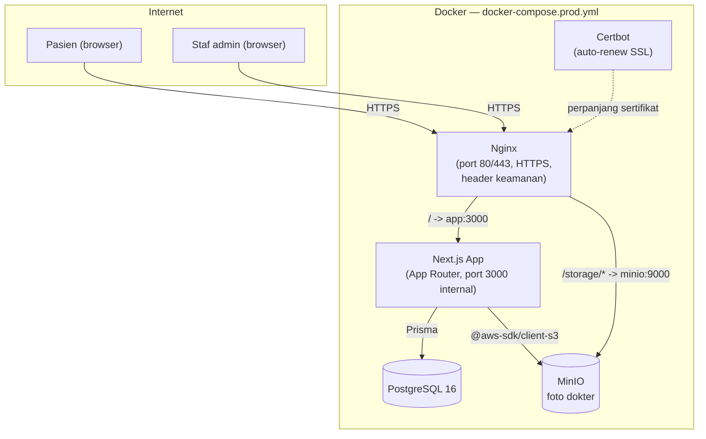
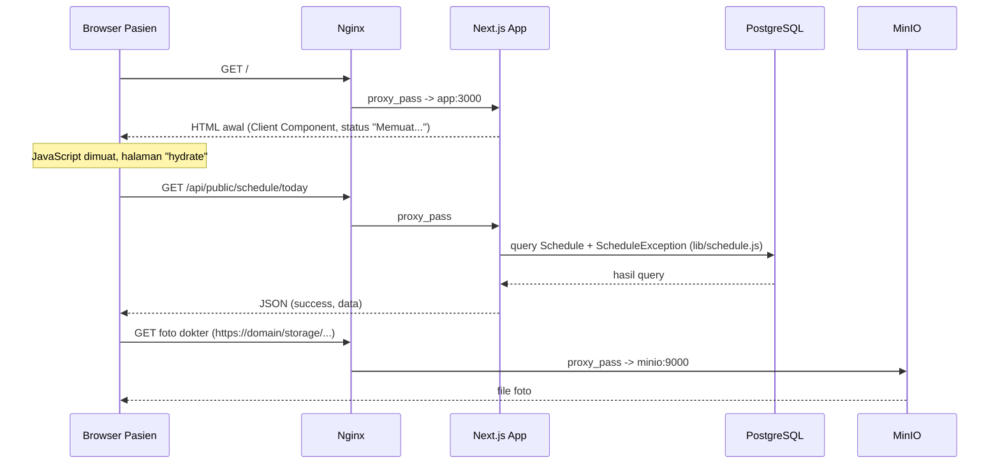
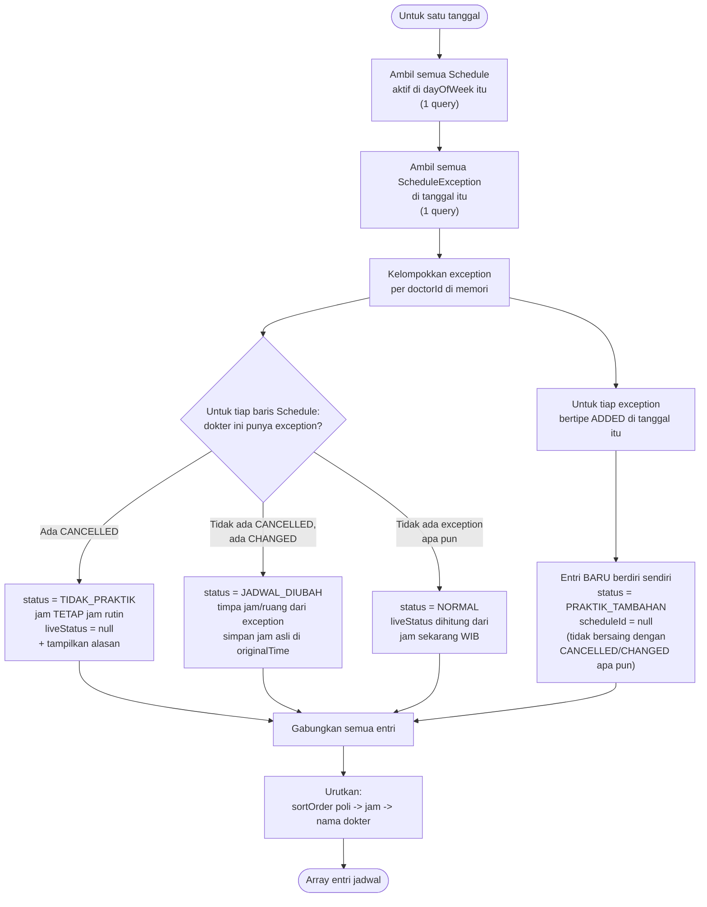
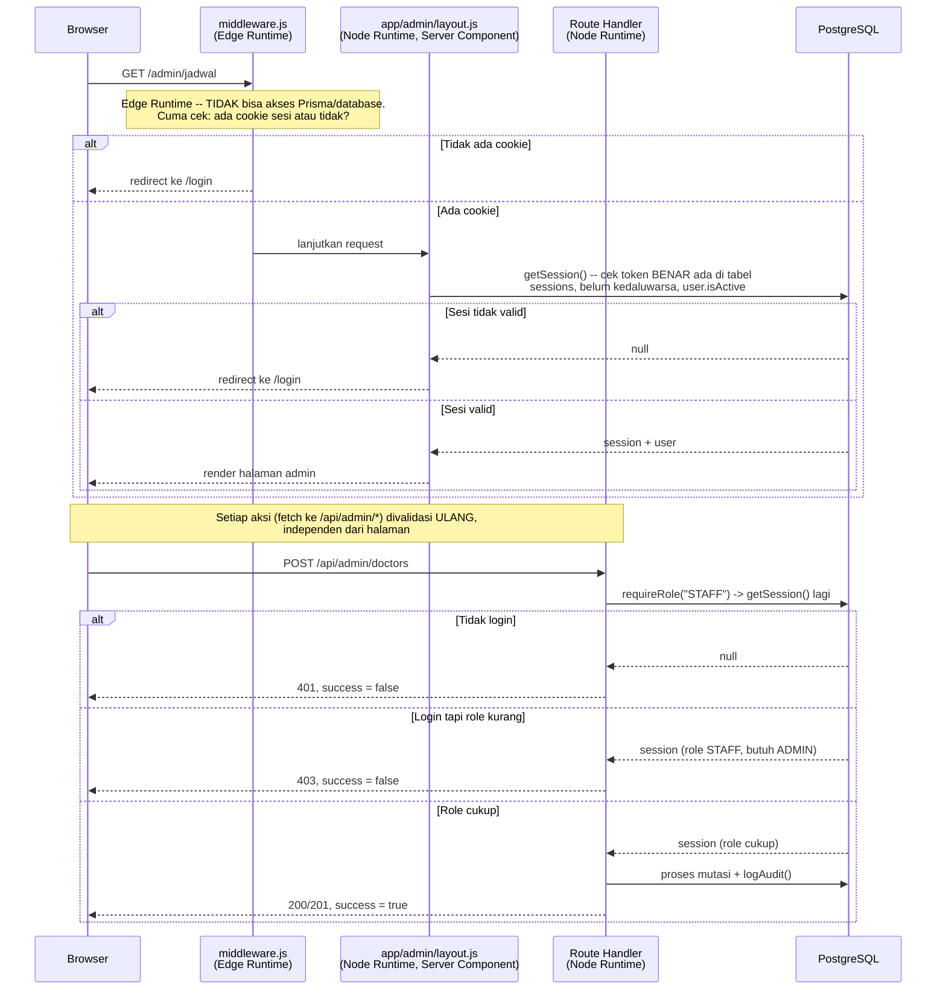

# Arsitektur

Dokumen ini menjelaskan alur teknis aplikasi: bagaimana request diproses,
bagaimana jadwal & pengecualian digabungkan, dan bagaimana autentikasi/role
bekerja. Ditulis untuk developer yang akan memelihara atau mengembangkan
project ini lebih lanjut.

## Daftar Isi

1. [Gambaran Umum Container](#1-gambaran-umum-container)
2. [Alur Request](#2-alur-request)
3. [Alur Penggabungan Jadwal + Pengecualian](#3-alur-penggabungan-jadwal--pengecualian)
4. [Alur Autentikasi & Role](#4-alur-autentikasi--role)

---

## 1. Gambaran Umum Container

Hanya Nginx yang punya port terbuka ke internet (lihat
`docker-compose.prod.yml`) — Postgres dan MinIO cuma bisa dijangkau
container lain lewat jaringan internal Docker.

## 2. Alur Request

Contoh: pasien membuka halaman "Jadwal Hari Ini".

Halaman publik (`/`, `/jadwal`, `/dokter`) adalah **Client Component** yang
mengambil data lewat `fetch()` ke API publik setelah halaman dimuat (bukan
Server Component yang query database langsung) — supaya auto-refresh (60
detik) dan filter interaktif (poli, tab hari) tidak perlu navigasi ulang.
Pengecualian: `app/dokter/[slug]/page.js` adalah Server Component yang
langsung memanggil `getDoctorSchedule()` dari `lib/schedule.js`, karena
halaman ini tidak butuh auto-refresh/interaktivitas kompleks.

## 3. Alur Penggabungan Jadwal + Pengecualian

Ini "otak aplikasi" (`lib/schedule.js`). Untuk setiap tanggal, jadwal rutin
(`Schedule`) digabung dengan pengecualian (`ScheduleException`) memakai
prioritas **CANCELLED > CHANGED > ADDED**:

**Optimasi N+1:** seluruh proses di atas hanya memakai **2 query database**
per tanggal (satu untuk Schedule, satu untuk ScheduleException) — bukan
query per dokter di dalam loop. `getWeekSchedule()` bahkan hanya memakai 2
query untuk **seluruh 7 hari sekaligus**: semua Schedule & ScheduleException
diambil sekali di awal, lalu dikelompokkan per hari di memori (JavaScript
biasa), baru diproses lewat alur di atas untuk masing-masing hari.

`getTodaySchedule()` dan `getScheduleForDate()` memanggil alur ini langsung.
`getWeekSchedule()` memanggilnya 7 kali secara berurutan (di memori, tanpa
query tambahan) untuk menghasilkan array 7 hari.

## 4. Alur Autentikasi & Role

Autentikasi memakai **cookie sesi httpOnly + token random** (bukan JWT,
bukan NextAuth) — lihat `lib/auth.js`. Ada dua lapis pengecekan yang
disengaja terpisah karena keduanya berjalan di **runtime yang berbeda**:

**Kenapa dua lapis?** `middleware.js` berjalan di **Edge Runtime** Next.js,
yang tidak mendukung Prisma (butuh Node.js runtime penuh) — jadi middleware
cuma bisa melakukan pengecekan murah (cookie ada/tidak) untuk langsung
menendang request yang jelas-jelas belum login, tanpa perlu hit database
sama sekali. Validasi SUNGGUHAN (token benar valid, belum kedaluwarsa, user
masih aktif) baru terjadi di `app/admin/layout.js` (Server Component, Node
Runtime) lewat `getSession()`, dan diulang lagi secara independen di **setiap
route handler API admin** lewat `requireRole()` — halaman dan API tidak
saling percaya begitu saja, supaya route API tetap aman diakses langsung
(bukan cuma lewat UI) dan tidak bergantung pada middleware yang bisa saja
salah konfigurasi.

**Hierarki role:** `ADMIN` (level 2) > `STAFF` (level 1). `requireRole("STAFF")`
meloloskan ADMIN maupun STAFF; `requireRole("ADMIN")` hanya meloloskan ADMIN.
Dipakai di baris pertama setiap route handler admin (lihat `lib/auth.js`).
